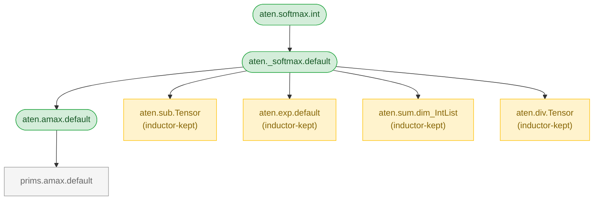

# decomposition-magician

Answer questions about PyTorch operator decompositions from the command line.

- *What ops does `batch_norm` actually compile to?*
- *Which primitive ops does my backend need to implement?*
- *Does this op decompose fully to core ATen?*
- *Which ops produce `squeeze.dims` as a child?*
- *Does my op have full DTensor sharding coverage?*

PyTorch's operator decompositions are recursive and the metadata is scattered across multiple subsystems. This tool makes that implicit structure observable — it traces decompositions automatically, classifies every op, and shows the result.


<sub><code>decomp-magician softmax --compile --mermaid</code> — green = decomposed, yellow = inductor-kept (terminal for torch.compile), gray = leaf</sub>

## Install

```
pip install git+https://github.com/stmcgovern/decomposition-magician.git
```

Requires Python 3.10+ and an existing, recent PyTorch installation (2.0+). The tool inspects whatever PyTorch you have — it does not install or constrain the version.

## What does torch.compile actually run?

The most common question. Use `--compile --leaves` to see the flat set of ops that hit the backend:

```
$ decomp-magician _native_batch_norm_legit --compile --leaves

aten._native_batch_norm_legit.default decomposes to:
  aten.mul.Tensor           x7  [inductor-kept]
  prims.mul.default         x4
  prims.add.default         x4
  aten.unsqueeze.default    x4  [inductor-kept]
  aten.squeeze.dims         x3  [inductor-kept]
  aten.copy_.default        x2
  aten.var_mean.correction  x1  [inductor-kept]
  aten.rsqrt.default        x1  [inductor-kept]
  aten.sub.Tensor           x1  [inductor-kept]
9 unique ops, 27 total instances
```

`--compile` treats inductor-kept ops as leaves. These are ops that *have* decompositions but Inductor deliberately skips them in favor of its own optimized lowerings. `--leaves` shows the flat frontier with propagated counts.

## Decomposition trees

Without `--leaves`, you get the full recursive tree — useful for understanding *why* an op produces what it does:

```
$ decomp-magician softmax

aten.softmax.int  [CIA]
└── aten._softmax.default  [table]
    ├── aten.amax.default  [table]
    │   └── prims.amax.default  [leaf]
    ├── aten.sub.Tensor  [table, inductor-kept]
    │   ├── aten.expand.default  [table, inductor-kept, untraceable]
    │   └── prims.sub.default  [leaf]
    ├── aten.exp.default  [table, inductor-kept]
    │   └── prims.exp.default  [leaf]
    ├── aten.sum.dim_IntList  [table, inductor-kept]
    │   └── prims.sum.default  [leaf]
    └── aten.div.Tensor  [table, inductor-kept]
        ├── aten.expand.default  [table, inductor-kept, untraceable]
        └── prims.div.default  [leaf]

14 ops (8 table, 1 CIA, 5 leaf) · 6 inductor-kept · 2 untraceable
```

Op names are resolved flexibly — bare names, fully qualified, C++ format (`aten::addcmul`), or substring match.

### Annotations

| Annotation | Meaning |
|---|---|
| `[table]` | Explicit decomposition in `decomposition_table` |
| `[CIA]` | CompositeImplicitAutograd kernel |
| `[both]` | Has both table and CIA decompositions |
| `[leaf]` | No decomposition; terminal op |
| `inductor-kept` | Has a decomposition, but Inductor skips it — uses a direct lowering instead |
| `untraceable` | Decomposition exists but could not be traced on meta tensors |

## More examples

**Diff** — what changes between full and compile mode?
```
$ decomp-magician softmax --diff

aten.softmax.int  (full)  vs  aten.softmax.int  (compile)

Removed  (in aten.softmax.int only):
  - aten.expand.default  x2
  - prims.sub.default  x1
  - prims.exp.default  x1
  - prims.sum.default  x1
  - prims.div.default  x1

Added  (in aten.softmax.int only):
  + aten.sub.Tensor  x1
  + aten.exp.default  x1
  + aten.sum.dim_IntList  x1
  + aten.div.Tensor  x1
```

In full decomposition, softmax reaches `prims` ops. In compile mode, Inductor keeps `sub`, `exp`, `sum`, `div` — they never decompose further.

**Reverse lookup** — which ops produce a given child op?
```
$ decomp-magician aten.squeeze.dims --reverse --depth 1
```

**Opset coverage** — does this op decompose fully to core ATen?
```
$ decomp-magician addcmul --target-opset core_aten
```

**Bulk statistics** — overview of the entire decomposition table:
```
$ decomp-magician --stats

Decomposition table statistics  (full decomposition)

  Total ops in table:  1127  (733 excluding _out variants)
  By type:             612 table, 121 both
  Inductor-kept:       111
  Traceable:           539 (74%)
  Untraceable:         194

Top leaf ops  (most common across all decompositions):
  aten.expand.default   422  ██████████████████████████████████████████
  prims.mul.default     197  ███████████████████
  aten.copy_.default    182  ██████████████████
  ...
```

**Model analysis** — which ops does an exported model use?
```
$ decomp-magician --model model.pt2 --target-opset core_aten
```

**DTensor coverage** — does this op have full sharding strategy coverage?
```
$ decomp-magician softmax --dtensor

aten.softmax.int  [CIA]  dtensor: ok (via decomp)
└── aten._softmax.default  [table]  dtensor: ok
    ├── aten.amax.default  [table]  dtensor: ok
    │   └── prims.amax.default  [leaf]  dtensor: ok (via ancestor)
    ├── aten.sub.Tensor  [table, inductor-kept]  dtensor: ok
    │   └── ...
    ├── aten.exp.default  [table, inductor-kept]  dtensor: ok
    │   └── ...
    ├── aten.sum.dim_IntList  [table, inductor-kept]  dtensor: ok
    │   └── ...
    └── aten.div.Tensor  [table, inductor-kept]  dtensor: ok
        └── ...

14 ops (8 table, 5 leaf, 1 CIA) · 6 inductor-kept · 2 untraceable · dtensor: covered
```

Each node shows its DTensor status: `ok` (direct registered strategy), `ok (via decomp)` (strategy traces through the decomposition), `ok (via ancestor)` (a parent intercepts before DTensor reaches this op), or `MISSING` (no coverage on any path). The summary gives an overall verdict.

**DTensor bulk coverage** — how much of the decomposition table is covered?
```
$ decomp-magician --stats --dtensor

...
DTensor coverage:
  Registered strategy:   346 (47%)
  Decomp fallback:       387
  No strategy:           0

  Fully covered trees:   489/560 (87%)
  Trees with gaps:       71

Top uncovered leaf ops  (most common gaps across all trees):
  aten.scalar_tensor.default    29
  prims.fft_r2c.default          6
  prims.normal.default           5
  ...
```

**Graph export** — Mermaid or Graphviz diagrams:
```
$ decomp-magician softmax --mermaid    # paste into GitHub markdown
$ decomp-magician softmax --dot        # pipe to: dot -Tsvg > graph.svg
```

## Flags

Start with `decomp-magician <op>`. Add `--compile` for torch.compile behavior, `--leaves` for the flat frontier.

**Core:**

| Flag | Description |
|------|-------------|
| `--compile` | Treat inductor-kept ops as leaves |
| `--leaves` | Show flat leaf frontier instead of tree |
| `--depth N` | Maximum recursion depth (-1 = unlimited, default) |
| `--json` | Machine-readable output (combines with most modes) |
| `--verbose` | Full classification details per op |
| `--no-color` | Disable colored output (respects `NO_COLOR` env var) |

**Analysis:**

| Flag | Description |
|------|-------------|
| `--reverse` | Find all ops that decompose into the given op |
| `--include-out` | Include `_out` variants in `--reverse` results |
| `--diff [OP2]` | Compare full vs compile, or compare two ops |
| `--stats` | Bulk statistics across all decomposable ops |
| `--model PATH` | Analyze an exported `.pt2` model |
| `--target-opset OPSET` | Check coverage against a target opset (e.g. `core_aten`) |
| `--backward` | Show ops dispatched during the backward pass |
| `--pure` | Check if decomposition is free of mutable/ADIOV ops |

**Export:**

| Flag | Description |
|------|-------------|
| `--mermaid` | Export as Mermaid flowchart |
| `--dot` | Export as Graphviz DOT graph |

**Dispatch introspection:**

| Flag | Description |
|------|-------------|
| `--dtensor` | Show DTensor sharding strategy coverage (per-op and ancestor-aware) |
| `--dispatch-table` | Show dispatch table entries per op |
| `--mode-sensitivity` | Show ops that differ under `inference_mode` vs `no_grad` |
| `--adiov` | Filter to paths reaching ADInplaceOrView ops |

## Limitations

- About 26% of decomposable ops cannot be traced on meta tensors (shape mismatches, data-dependent control flow). These are marked `[untraceable]` and `--leaves` warns when the frontier is incomplete.
- The tool uses the raw `decomposition_table`, not Inductor's internal table. The `--compile` flag correctly identifies terminal ops for Inductor, but the intermediate path may differ for the ~111 ops where Inductor uses custom decompositions.
- Substring matching only searches the `aten` namespace. Ops in `prims`, `quantized`, etc. require exact names.
