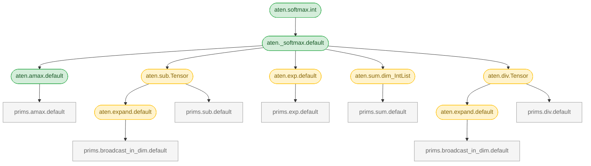

# decomposition-magician

See what PyTorch operators actually decompose into.

```
$ decomp-magician softmax

aten.softmax.int  [CIA]
└── aten._softmax.default  [table]
    ├── aten.amax.default  [table]
    │   └── prims.amax.default  [leaf]
    ├── aten.sub.Tensor  [table, inductor-kept]
    │   ├── aten.expand.default  [table, inductor-kept]
    │   │   └── prims.broadcast_in_dim.default  [leaf]
    │   └── prims.sub.default  [leaf]
    ├── aten.exp.default  [table, inductor-kept]
    │   └── prims.exp.default  [leaf]
    ├── aten.sum.dim_IntList  [table, inductor-kept]
    │   └── prims.sum.default  [leaf]
    └── aten.div.Tensor  [table, inductor-kept]
        ├── aten.expand.default  [table, inductor-kept]
        │   └── prims.broadcast_in_dim.default  [leaf]
        └── prims.div.default  [leaf]

16 ops (8 table, 7 leaf, 1 CIA) · 6 inductor-kept
```

Traces decompositions on meta tensors, then classifies each op against PyTorch's decomposition table, inductor table, and dispatch system. Works with whatever PyTorch version you have installed.

## Install

```
pip install git+https://github.com/stmcgovern/decomposition-magician.git
```

Requires Python 3.10+ and PyTorch 2.0+.

## What does torch.compile actually run?

```
$ decomp-magician _native_batch_norm_legit --compile --leaves

aten._native_batch_norm_legit.default decomposes to:
  aten.mul.Tensor           x7  [inductor-kept]
  aten.add.Tensor           x4
  aten.unsqueeze.default    x4  [inductor-kept]
  aten.squeeze.dims         x3  [inductor-kept]
  aten.copy_.default        x2
  aten.var_mean.correction  x1  [inductor-kept]
  aten.rsqrt.default        x1  [inductor-kept]
  aten.sub.Tensor           x1  [inductor-kept]
8 unique ops, 23 total instances
```

`--compile` uses `select_decomp_table()` — the actual table `torch.compile` uses. Inductor-kept ops have decompositions but Inductor skips them for its own lowerings.

## What do the annotations mean?

| Annotation | Meaning |
|---|---|
| `[table]` | In `decomposition_table` |
| `[CIA]` | CompositeImplicitAutograd kernel |
| `[both]` | Both table and CIA |
| `[leaf]` | No decomposition — terminal op |
| `inductor-kept` | In the decomposition table but not decomposed by Inductor |

## DTensor strategy coverage

`--dtensor` shows which ops in the decomposition chain have DTensor sharding strategies — distinguishing `registered` (explicit strategy) from `decomp-fallback` (derives strategy by decomposing into ops that have strategies):

```
$ decomp-magician _native_batch_norm_legit --dtensor --depth 1

aten._native_batch_norm_legit.default  [table, mutable]  dtensor: decomp-fallback
├── aten.var_mean.correction  [table, inductor-kept]  dtensor: registered
├── aten.add.Tensor  [table]  dtensor: registered  x4
├── aten.rsqrt.default  [table, inductor-kept]  dtensor: registered
├── aten.sub.Tensor  [table, inductor-kept]  dtensor: registered
├── aten.mul.Tensor  [table, inductor-kept]  dtensor: registered  x7
├── aten.squeeze.dims  [table, inductor-kept]  dtensor: registered  x3
├── aten.copy_.default  [leaf, mutable]  dtensor: registered  x2
└── aten.unsqueeze.default  [table, inductor-kept]  dtensor: registered  x4

9 ops (8 table, 1 leaf) · 6 inductor-kept · dtensor: no gaps
```

If any op in the chain lacks a strategy, `DecompShardingStrategy` cannot produce a sharding plan for the whole op. `--stats --dtensor` shows coverage across all ops.

## Graph export

`--mermaid` produces a diagram that renders directly on GitHub:



`--dot` produces Graphviz DOT format for local rendering.

## Other things you can do

Run `decomp-magician --help` for the full list. A few highlights:

```
decomp-magician softmax --source              # show the decomposition function source
decomp-magician softmax --diff                # full vs compile-mode leaf diff
decomp-magician aten.squeeze.dims --reverse   # which ops produce this child?
decomp-magician --stats                       # bulk statistics across all ops
decomp-magician addcmul --target-opset core_aten  # check opset coverage
decomp-magician --model model.pt2             # analyze an exported model
```

All modes support `--json` for machine-readable output.

## Limitations

- ~11% of decomposable ops can't be traced on meta tensors. These are marked `[untraceable]`.
- Decompositions with value-dependent control flow (e.g. `pow` dispatching to `sqrt` vs `mul` vs `prims.pow`) may show different children depending on synthetic input values.
- `--compile` correctly identifies terminal ops via `select_decomp_table()`, but ~112 ops where Inductor uses custom decomposition functions may show different intermediate paths.
